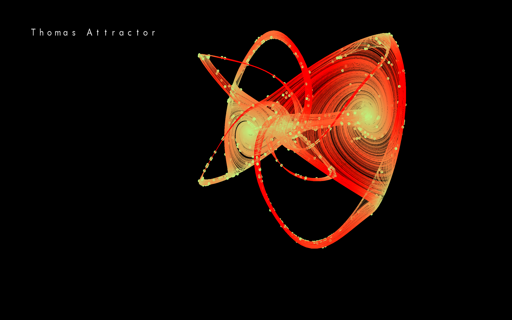

# Lorenz Attractor



Compile and run

1. Download SFML

2. Run this:

```shell
g++ main.cpp LorenzAttractor.cpp -o main -lsfml-graphics -lsfml-window -lsfml-system -I/Library/Frameworks/SFML.framework/Headers -I/Users/cyrill/Downloads/SFML-2.5.1-macos-clang/include/ -L/Users/cyrill/Downloads/SFML-2.5.1-macos-clang/lib -L/Users/cyrill/Downloads/SFML-2.5.1-macos-clang/extlibs -std=c++17 -O3
./main
```

Tested on OS X, adjust the paths accordingly.

Controls


H to switch to the next attractor

W/A/S/D for moving in the plane 

Space/Shift to move up and down

Up/Down/Left/Right to turn the camera

